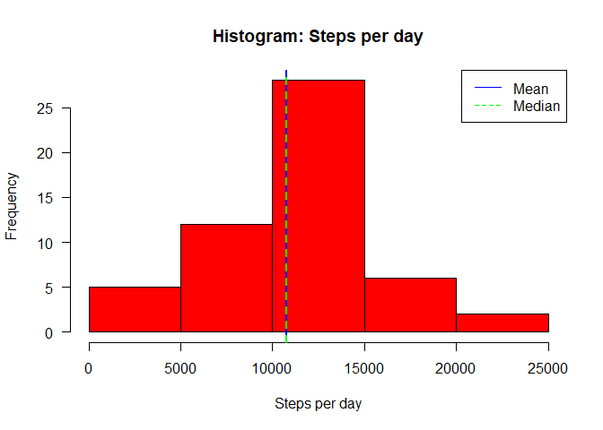
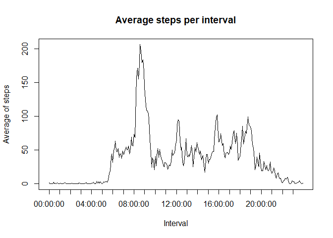
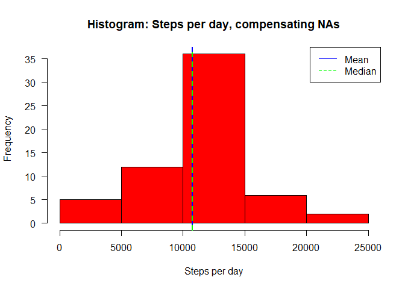
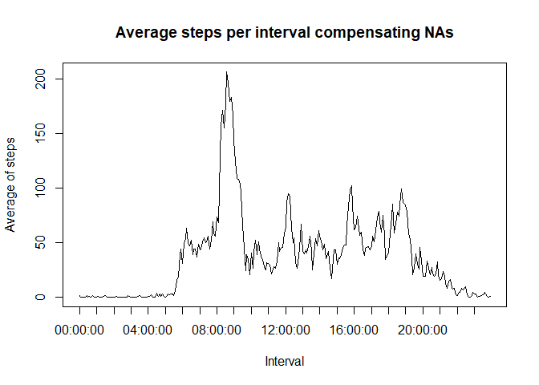
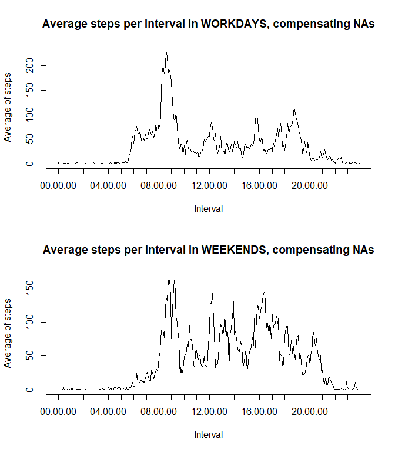

Activity Monitoring Data Analysis
====================================================================

### Loading and preprocessing the data

1. We **unzip** the file stored in our working directory.
2. We **read** the file whithin the zip file ("activity.csv") and we name it **dat**.
3. **Change** the class of "date" variable from character to date.
4. Change the **format** of the variable **"interval"**. This variable shows several problems, which make difficult to work whith it: it is a numeric variable where of the observation taken every 5 minuts during the day the format is:  \
        - 5 for 00:00 \
        - 55 for 00:55 \
        -100 for 01:00 \
        -1000 for 10:00 \
So, what we have to do is: \
a. **to pad** the variable on **4 digits** adding 0s on the left when necessary, using **str_pad** of the package "stringr"; \
b. Insert **":"** after the first two digits (00:00), using **paste() and substr;** \
c. Paste **"date" and "interval"** within interval, so that every intevral will have the following POSIXct format: YYYY-mm-dd HH:MM.
        

```r
dat <- unzip("repdata_data_activity.zip", "activity.csv")
dat <- read.csv(dat)
str(dat) # see the formats before of making changes in "date" and interval.
```

```
'data.frame':	17568 obs. of  3 variables:
 $ steps   : int  NA NA NA NA NA NA NA NA NA NA ...
 $ date    : chr  "2012-10-01" "2012-10-01" "2012-10-01" "2012-10-01" ...
 $ interval: int  0 5 10 15 20 25 30 35 40 45 ...
```

```r
dat$date <- as.Date(dat$date)
dat$steps <- as.numeric(dat$steps)
library(stringr)
dat$interval <- str_pad(dat$interval, 4, pad = "0")
n <- 3
dat$interval <- paste(substr(dat$interval, 1, n-1), ":", substr(dat$interval, n, nchar(dat$interval)), sep = "")
dat$interval <- paste(dat$interval, ":00", sep = "")
library(chron)
dat$interval <- times(dat$interval)
str(dat)
```

```
'data.frame':	17568 obs. of  3 variables:
 $ steps   : num  NA NA NA NA NA NA NA NA NA NA ...
 $ date    : Date, format: "2012-10-01" "2012-10-01" "2012-10-01" ...
 $ interval: 'times' num  00:00:00 00:05:00 00:10:00 00:15:00 00:20:00 ...
  ..- attr(*, "format")= chr "h:m:s"
```

### Total number of steps taken per day

1. We load the dplyr library (and we put the chunk option "message=FALSE" to cover
 antiesthaetic message when RStudio loads dplyr).
2. We generate a dataframe (stepsDay) of 53 observations and 2 variables: date and steps.perDay. To do that we have to remove NAs, to group the observations by date and to sum the total steps for each day.
3. We generate an histogram of the frequency of the different magnitudes of steps.perDay.


```r
library(dplyr)
stepsDay <- dat %>%
        filter(!is.na(steps)) %>%
        group_by(date) %>%
        summarise(steps.perDay = sum(steps))
hist(stepsDay$steps.perDay, main = "Histogram: Steps per day", xlab = "Steps per day",las = 1, col = "red")
abline(v = c(mean(stepsDay$steps.perDay), median(stepsDay$steps.perDay)), lwd = c(2,2), col = c("blue", "green"), lty = c(1,2))
legend("topright", lty = c(1,2), col = c("blue", "green"), legend = c("Mean", "Median"))
```

<!-- -->

4. Then we calculate the mean and the median steps per day.


```r
meanSteps <- stepsDay %>%
        summarise(mean = mean(steps.perDay))
medianSteps <- stepsDay %>%
        summarise(median = median(steps.perDay))
```

The mean of steps taken per day is **10766.19** and the median is **10765.00**.

## Average daily activity pattern

Using a classical dplyr combination we generate a data frame that shows the average of steps taken per any daily interval. \
Then we plot it using the plot graphic putting intervals on the X-axis and average of steps on the y-axis.

```r
stepsmean<- dat %>%
        filter(!is.na(steps)) %>%
        group_by(interval) %>%
        summarise(mean = mean(steps))
plot(stepsmean$interval, stepsmean$mean, xaxt="n", type = "l", main = "Average steps per interval", xlab = "Interval", ylab = "Average of steps")
tt <- seq(times("00:00:00"), times("23:55:00"), times("01:00:00"))
axis(1, tt, font = 1, times(tt))
```

<!-- -->
\
We can identify the interval of max average steps using the **which.max() function**.


```r
maxsteps <- stepsmean[which.max(stepsmean$mean),]
```

The 5-minute interval that, on average, contains the **maximum** number of steps is the **08:35:00 interval**.

## Imputing missing values


```r
globaldat <- summary(dat)
```

1. The **total number of missing values** in the data set is **NA's   :2304  ,** all concentrated in the "steps" variable.\
2. Our strategy is to fill in the missing values using the mean values within the same interval.\
3. For that, (i.e. to substitute the NAs whith the mean values) we will use the **data.table** package, which is in our opinion the simplest way to do that.
4. Subsequently we plot an histogram of the daily average of the steps taken and we plot a the time series of the daily average of steps taken per 5 minutes intervals.

```r
library(data.table)
dt = data.table(date = dat$date,interval = dat$interval, steps = dat$steps)
dt[, steps := ifelse(is.na(steps), round(mean(steps, na.rm = T),0), steps), by = interval]
str(dt)
```

```
Classes 'data.table' and 'data.frame':	17568 obs. of  3 variables:
 $ date    : Date, format: "2012-10-01" "2012-10-01" "2012-10-01" ...
 $ interval: 'times' num  00:00:00 00:05:00 00:10:00 00:15:00 00:20:00 ...
  ..- attr(*, "format")= chr "h:m:s"
 $ steps   : num  2 0 0 0 0 2 1 1 0 1 ...
 - attr(*, ".internal.selfref")=<externalptr> 
```

```r
stepsDayNA <- dt %>%
        group_by(date) %>%
        summarise(steps.perDayNA = sum(steps))
hist(stepsDayNA$steps.perDayNA, main = "Histogram: Steps per day, compensating NAs", xlab = "Steps per day",las = 1, col = "red")
abline(v = c(mean(stepsDayNA$steps.perDayNA), median(stepsDayNA$steps.perDayNA)), lwd = c(2,2), col = c("blue", "green"), lty = c(1,2))
legend("topright", lty = c(1,2), col = c("blue", "green"), legend = c("Mean", "Median"))
```

<!-- -->

```r
stepsmeanNA <- dt %>%
        group_by(interval) %>%
        summarise(mean = mean(steps))
plot(stepsmeanNA$interval, stepsmeanNA$mean, xaxt="n", type = "l", main = "Average steps per interval compensating NAs", xlab = "Interval", ylab = "Average of steps")
tt <- seq(times("00:00:00"), times("23:55:00"), times("01:00:00"))
axis(1, tt, font = 1, times(tt))
```

<!-- -->
\
We can see that both plots are not very different from the plots without compensating the NAs.\

4. Calculating the mean and the median of the total daily steps in order to compare them with those showed above.


```r
meanStepsNA <- stepsDayNA %>%
        summarise(mean = mean(steps.perDayNA))
medianStepsNA <- stepsDayNA %>%
        summarise(median = median(steps.perDayNA))
```

We can see that the mean, compensating NAs, of steps taken per day is **10765.64** and the median is **10762.00**.\
As we hve seen above, without replacement of NAs, the mean and the median of steps taken per day are respectively **10766.19** and **10765.00**.\
Which means in our opinion that replacing NAs **did not produce a significant change** in the total of daily steps.

## Differences in activity patterns between weekdays and weekends

To anayze the differences in the activity patterns between weekdays and weekends, we have created the new factor variable **"day_class"** in the dataset, with two levels, **“weekend” and “workday”** indicating whether a given date is a weekday or weekend day:

```r
dt <- dt %>%
        mutate(day_class = if_else(weekdays(date) == "sábado" | weekdays(date) == "domingo", "weekend", "workday"))
# "sábado" is "saturday" in spanish and "domingo" is "sunday".
# No need to change the weekday names, because we did not create a variables of weekdays.

dt$day_class <- as.factor(dt$day_class)
str(dt)
```

```
## 'data.frame':	17568 obs. of  4 variables:
##  $ date     : Date, format: "2012-10-01" "2012-10-01" "2012-10-01" ...
##  $ interval : 'times' num  00:00:00 00:05:00 00:10:00 00:15:00 00:20:00 ...
##   ..- attr(*, "format")= chr "h:m:s"
##  $ steps    : num  2 0 0 0 0 2 1 1 0 1 ...
##  $ day_class: Factor w/ 2 levels "weekend","workday": 2 2 2 2 2 2 2 2 2 2 ...
```


We made **a panel plot** containing a time series plot of the 5-minute interval (x-axis) and the average number of steps taken averaged across all weekday days (y-axis), and another for the  weekend days (y-axis).

```r
stepsmeanWD <- dt %>%
        filter(day_class == "workday") %>%
        group_by(interval) %>%
        summarise(mean = mean(steps))
stepsmeanWE <- dt %>%
        filter(day_class == "weekend") %>%
        group_by(interval) %>%
        summarise(mean = mean(steps))

par(mfrow = c(2,1))
plot(stepsmeanWD$interval, stepsmeanWD$mean, xaxt="n", type = "l", main = "Average steps per interval in WORKDAYS, compensating NAs", xlab = "Interval", ylab = "Average of steps")
tt <- seq(times("00:00:00"), times("23:55:00"), times("01:00:00"))
axis(1, tt, font = 1, times(tt))
plot(stepsmeanWE$interval, stepsmeanWE$mean, xaxt="n", type = "l", main = "Average steps per interval in WEEKENDS, compensating NAs", xlab = "Interval", ylab = "Average of steps")
tt <- seq(times("00:00:00"), times("23:55:00"), times("01:00:00"))
axis(1, tt, font = 1, times(tt))
```

<!-- -->

So, we can see two patterns clearly different: \
1. Workdays show an activity pattern mainly concentrated on two clear peaks: around 8:00 interval and 19:00 interval, and a clear fall after the 20:00 interval. \
2. Activity pattern in the weekends shows a wider distribution during the whole day with several peaks, while the activity falls much later, arounr the 21:30 interval.


